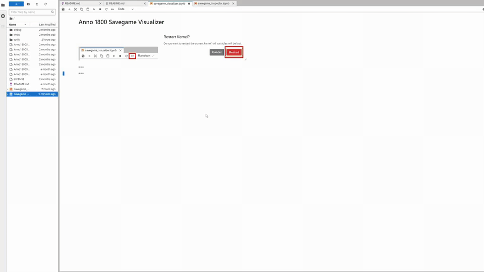
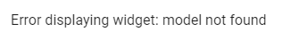
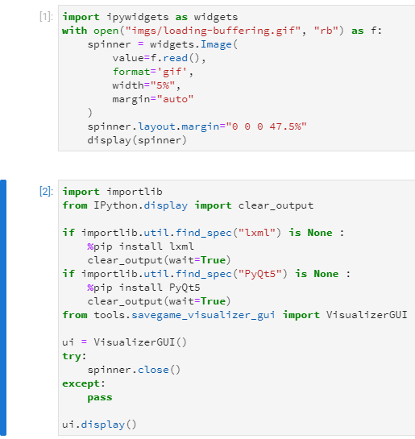
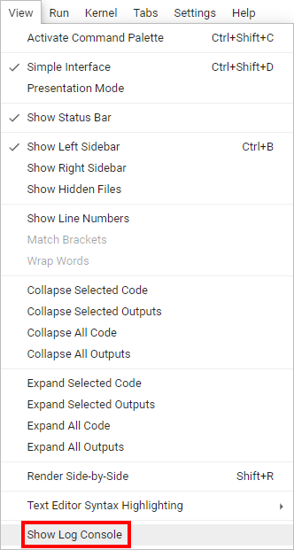

 

# Anno 1800 Savegame Visualizer
Turn your [Anno 1800](https://www.ubisoft.com/de-de/game/anno-1800/) savegames into [Anno Designer](https://github.com/AnnoDesigner/anno-designer) layouts with just a few clicks! Eases the creation of production layout and the process of copying islands.

## Getting started
1. Download and install Jupyter Lab: https://github.com/jupyterlab/jupyterlab-desktop/releases/latest - The installation process consists of two stages and opens multiple windows, so make sure not to hide them. Always use the default settings (an exception is the question for whom to install the software, here you can opt for "just me" instead of "everyone"). The second step installs a Python environment. The path must NOT contain spaces or special characters.
2. Download and install .NET:  https://dotnet.microsoft.com/en-us/download/dotnet/thank-you/runtime-5.0.17-windows-x64-installer
3. Download the latest release of this repository: https://github.com/nihoel/Anno1800SavegameVisualizer/releases/latest
4. Extract the archive to some directory on your computer. Make sure to not change anything inside the tools folder!
5. Double click on savegame_visualizer.ipynb (must open in Jupyter Lab).
6. The two images at the top of the software show which buttons you need to click to run the software.
7. If you have some basic coding skills in Python, you can open savegame_inspector.ipynb to further explore a savegame.

## Troubleshooting
#### The preview does not update and the button to open Anno Designer does nothing
Close all instances of Anno Designer (use the task manager) and restart the software.

#### Error displaying widget

That is normal when you open the software. Run the software as usual and the user interface will appear.

#### Code expanded

If you have opened one of the two blocks depicted above: Click on the blue bar on the left to collapse it. Make sure you didn't change anything there by accident. If strange things happen afterwards, re-download the software

#### WinError in status bar
Some virus scanners identify `RdaConsole.exe` as virus
Add the executable to the exception list of your virus scanner (you may re-do this after an update or moving the folder).

#### Error in the status bar
Contact me if you fail to understand or resolve the error displayed there. To help me solve the issue, open the log console and copy its content.

## Contact and Feedback
* Join the Anno Designer discord: https://discord.gg/5CC2pz8B3j
* Ask questions or give feedback in the #savegame-visualizer channel or write me a message (user: DuxVitae#7882)
* I welcome any kind of feedback: Bugs, user experience improvements, feature suggestions.

## Special Thanks
* [StingMcRay](https://github.com/StingMcRay) for extracting and adding necessary information to the Anno Designer files
* The [Anno Designer](https://github.com/AnnoDesigner/anno-designer) team for their great tool (which is part of the distributed binaries)
* [Taubenangriff](https://github.com/taubenangriff) for his support on extracting savegames and the two tools included in the binaries:
    * [RdaConsole](https://github.com/anno-mods/RdaConsole)
    * [FileDBReader](https://github.com/anno-mods/FileDBReader)
    
## Known issues
* Older savegames may not work or show unexpected behaviour.
* Auto update fails silently if Anno Designer is running.
* New buildings do not have appropriate color scheme

## Disclaimer
The software is provided without warranty of any kind. The work was NOT endorsed by Ubisoft Blue Byte in any kind. All the assets from Anno 1800 game are © by Ubisoft.

## License
[MIT](https://github.com/NiHoel/Anno1800SavegameVisualizer/blob/main/LICENSE)
